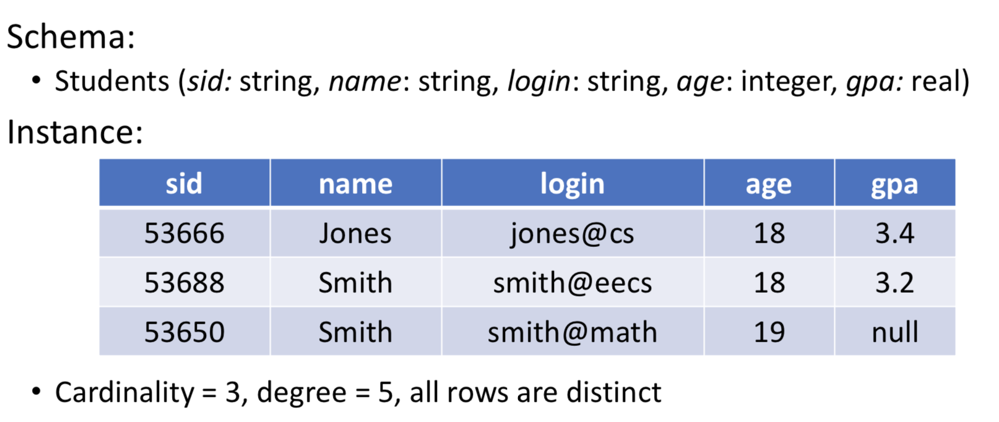
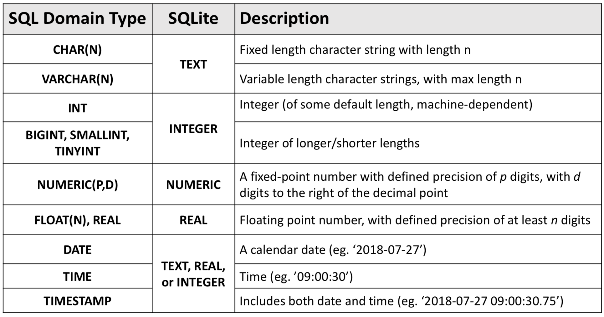

# Relation Database & SQL

## Common relation database
- MySQL
- Oracle SQL
- SQLite

## Relation database
Three levels of abstraction
1. Physical level: how data are actually stored
2. Conceptual (or logical) level: how data is perceived by the users
3. External (or view) level: describes different parts of the database to different users
- Convenience, security, etc.
- Eg. compare views of student, registrar, and database admin

Two dependences
- Physical Data Independence (ability to modify physical schema without changing logical schema)
- Logical Data Independence (done with views)

## Terminology
- Relational Database: a set of relations
- Relation: a set of rows or tuples (all rows are distinct), defined by 2 parts:
  - Schema: specifies name of relation, plus name and type of each column • E.g. Students (sid: string, name: string, login: string, age: integer, gpa: real)
  - Instance: a table, with rows and columns
  
- Cardinality: number of rows
- Degree/Dimension: number of fields

## ACID – Properties of Database Transactions

- Atomic
- Consistent
- Isolated
- Durable

## SQL
Structured Query Language (SQL) is a standard language, commands are mainly categorized as:

1. Data Definition Language (DDL): used to create database, schemas, tables
2. Data Manipulation Language (DML): used to query/modify the data
3. Data Control Language (DCL): administration and  control permission to access database

## Data Definition Language (DDL)

Common DDL commands include: CREATE, DROP, ALTER ...

### CREATE

```SQL
CREATE TABLE worker(
  'w_id' INTEGER,
  'name' TEXT,
  'gender' TEXT
);
```
The type of data is also called __Domain constraints__. It is forced by the DBMS whenever tuples are added or modified.



### DROP

```SQL
DROP TABLE worker;
```
This deletes the table


### ALTER

```SQL
ALTER TABLE worker ADD COLUMN "age" INTEGER;
```
This adds a new column to database and extends the current instances with NULL values in the new column.

## Data Manipulation Language (DML)

Common DML commands include: INSERT, DELETE, UPDATE ...

### INSERT

```SQL
INSERT
INTO worker (w_id, name, gender, age)
VALUES (111, "Edward", "MALE", 25);
```
This inserts a new instance.

### DELETE

```SQL
DELETE
FROM worker
WHERE name = "Edward";
```
This removes all instances satisfying the condition.

### UPDATE

```SQL
UPDATE worker
SET age = 26
WHERE name = "Edward";
```
This updates all instances satisfying the condition.

## Data Control Language (DCL)
The DBMS checks to see if you have appropriate permissions before executing a database task.

```SQL
GRANT privilege ON object
TO {user_name | role_name | PUBLIC} [WITH GRANT OPTION]

REVOKE privilege ON object
FROM {user_name | role_name | PUBLIC}
```

Some examples:
```SQL
/* For the ability to execute an application program*/
GRANT EXECUTE ON PLAN __________ TO _________
/* For the ability to perform a backup*/
GRANT BACKUP ON PLAN__________TO_________
/* For the ability to execute an application program */
GRANT EXECUTE ON PLAN __________ TO _________
```

## Integrity Constraints (IC's)
Integrity Constraint: condition that must be true for any instance of the database, eg. Domain constraints. A legal instance must satisfy all specified IC's.


## Key Constraint

### Primary key

A set S={S1, S2, ..., Sm} of fields in an n-degree relation (where 1<= m <= n, but m is often 1), is a key for a relation if:
1. No two distinct tuples can have the same values in all the key fields, and
2. No subset of S is itself a key (according to (1)); If such a subset exists, then S
would be called a superkey and not a key

e.g. {w_id} is a key for __worker__. {w_id, age} is a superkey.

If there is more than 1 possible key for a relation, then one of these candidate keys is chosen (by the DBA) to be the primary key

```SQL
CREATE TABLE Worker (
  "w_id" INTEGER,
  "name" TEXT,
  "age" INTEGER,
  PRIMARY KEY (w_id),
);
```
Primary key1 1) must be unique and 2) cannot be NULL.


### Foreign Keys and Referential Integrity

Foreign key: Set of fields in one table that is used to ‘reference’ a tuple in another relation (Must correspond to the primary key of the other relation)

Referential integrity: achieved when all foreign key constraints are enforced

```SQL
CREATE TABLE department (
  'd_id' INTEGER,
  'w_id' INTEGER,
  'title' TEXT,
  PRIMARY KEY (d_id),
  FOREIGN KEY (w_id),
  REFERENCES worker
);
```

Only workers listed in the worker relation should be allowed to register in department.

### Enforcing Referential Integrity

What if a worker leave the company? His/her record is going to be removed from the relation.

```SQL
CREATE TABLE department (
  'd_id' INTEGER,
  'w_id' INTEGER,
  'title' TEXT,
  PRIMARY KEY (d_id),
  FOREIGN KEY (w_id),
  REFERENCES worker
  ON DELETE CASCADE
  ON UPDATE CASCADE
);
```

Default is `NO ACTION`.

`CASCADE` allows to update/delete all tuples that refer to the updated/deleted tuple.

`SET NULL / SET DEFAULT`:referencing tuple value is set to the default foreign key value.
