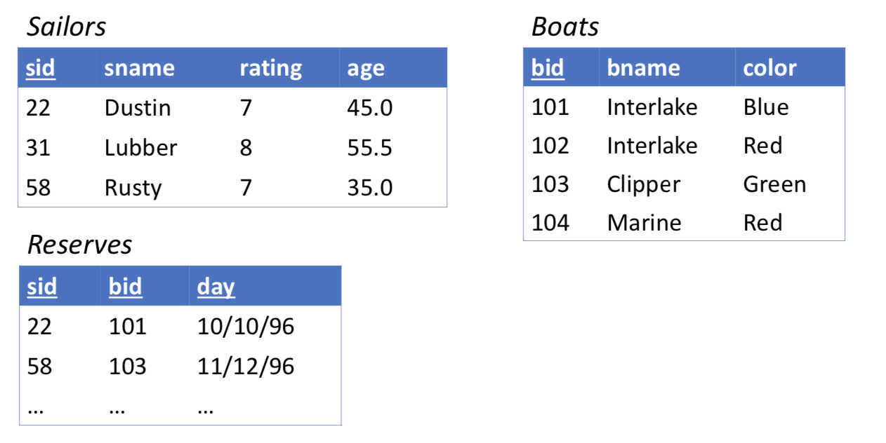

# SQL Querying

## Basic SQL Query Structure

Basic format
```SQL
select col_1, col_2, ..., col_n  (attributes)
from table_1, table_2, ..., table_m (relations)
where p (condition)
```

## Example
__The example was taken from Bhav Dhillon notes.__



Q. Find the rating of all the sailors
```
SELECT rating
FROM Sailors;
```

Q. Find the entire table
```
SELECT *
FROM Sailors;
```

Q. Find Sailors with rating < 8
```
SELECT *
FROM Sailors
WHERE rating < 8;
```

## Basic Operators

- Comparison operators: =, <>(not equal), >, <, >=, <=
- arithmetic operations: +, - , \*, /
- operations on string
  - `||` concatenate string
  - `LIKE` string like
- other operations
  - `in`
  - `distinct`Removes duplicates on specified attribute
  - `...`


## SQL Join

Q. Find the boat ID’s of boats and the names
of sailors who have reserved them

```SQL
SELECT bid, sname
FROM Reserves r, Sailors s,
WHERE r.sid = s.sid;
```

Q. Find sailors who have reserved
at least one boat
```SQL
SELECT DISTINCT sid
FROM Reserves r, Sailors s,
WHERE r.sid = s.sid;
```

Q. Find the name and age of sailors who have reserved boat 103; rename age to “sailor_age”
```SQL
SELECT sname, age AS sailor_age
FROM Reserves r, Sailors s,
WHERE r.sid = s.sid AND r.bid = 103;
```

### SQL self-joins

Q. Find pairs of id’s of sailors of the same age

```SQL
SELECT s1.sid, s2.sid
FROM Sailors s1, Sailors s2
WHERE s1.age = s2.age;
```

Q. Find pairs of sailor id’s (i, j) such that i is older than j and i is rated higher than j

```SQL
SELECT s1.sid, s2.sid
FROM Sailors s1, Sailors s2
WHERE s1.age > s2.age AND s1.rating > s2.rating;
```
Q.Find pairs of sailor id’s (i, j) such that their ratings are different and they both have reserved at least one common boat

```SQL
SELECT s1.sid, s2.sid
FROM Sailors s1, Sailors s2, Reserves r1, Reserves r2
WHERE s1.rating <> s2.rating
AND s1.sid = r1.sid
AND s2.sid = r2.sid
AND r1.bid = r2.bid;
```

Q. Find pairs of sailor id’s (i, j) such that their ratings are different and they both have reserved at least one boat with the same colour

```SQL
SELECT s1.sid, s2.sid
FROM Sailors s1, Sailors s2, Reserves r1, Reserves r2, Boats b1, Boats b2
WHERE s1.rating <> s2.rating
AND r1.bid = r2.bid
AND r1.sid = s1.sid
AND r2.sid = s2.sid
AND b1.bid = r1.bid
AND b2.bid = r2.bid
AND b1.color = b2.color;
```
