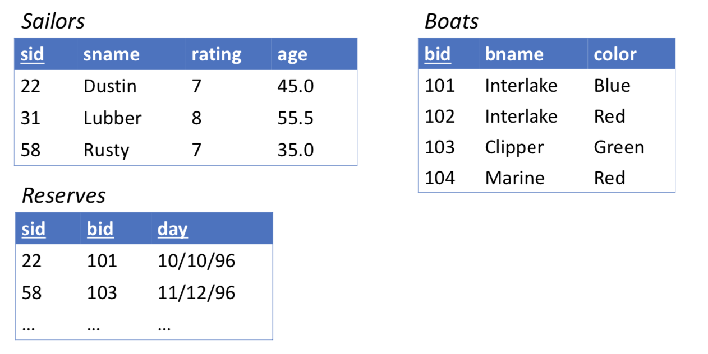

# Advanced SQL Querying

## Set operators

- Union : all tuples from set A and all tuples from set B
- Intersect : tuples that are present in both sets A and B
- Except : tuples in set A that are not present in set B

\*: set operations automatically eliminate duplicates
\*: To retain all duplicates use the corresponding multiset versions:
- union all
- intersect all
- except all

## Example
__The example was taken from Bhav Dhillon notes.__



Q. Find sid’s of sailors who have reserved a red or a green boat

version1
```SQL
SELECT r.sid
FROM Reserves r, Boats b
WHERE r.bid = b.bid
AND (b.color = "Green" or b.color ="Red");
```
version2

```SQL
SELECT r.sid
FROM Reserves r, Boats b
WHERE r.bid = b.bid AND b.color = "Green"
UNION
SELECT r.sid
FROM Reserves r, Boats b
WHERE r.bid = b.bid AND b.color = "Red";
```

Q. Find sid’s of sailors who have reserved a red and a green boat

version1
```SQL
SELECT r1.sid
FROM Reserves r1, Boats b1, Reserves r2, Boats b2
WHERE r1.bid = b1.bid
AND r2.bid = b2.bid
AND r1.sid = r2.sid
AND b1.color = "Green"
AND b2.color ="Red";
```
version2

```SQL
SELECT r.sid
FROM Reserves r, Boats b
WHERE r.bid = b.bid AND b.color = "Green"
INTERSECT
SELECT r.sid
FROM Reserves r, Boats b
WHERE r.bid = b.bid AND b.color = "Red";
```

## Strings and Substring Matching

Q. Find the age of sailors whose names begin with a ‘B’ and end with an ‘s’ and contain at least three characters
```SQL
SELECT age
FROM Sailors
WHERE sname LIKE "B_%s";
```

- LIKE is used for string matching
- _ stands for any one character
- % stands for 0 or more arbitrary characters

## Arithmetic Expressions

Q. For sailors whose names begin with a ‘B’ and end with an ‘s’ and contain at least three characters, find their age-5 and 2*age

```SQL
SELECT age - 5 AS age1, age * 2 AS age2
FROM Sailors
WHERE sname LIKE "B_%s";
```

## Ordering/Sorting of Tuples
List in alphabetic order the names of the sailors who have reserved a red boat
```SQL
SELECT DISTINCT sname
FROM Sailors s, Boats b, Reserves r
WHERE s.sid = r.sid
AND b.bid = r.bid
AND b.color = "Red"
ORDER BY sname ASC;
```
- `asc` for ascending order
- `desc` for descending order

## Nested Queries

- Nested queries are simply a query within a query
- A WHERE clause can itself contain a SQL query
- IN, EXISTS

Q. Find the names of sailors who’ve reserved boat \#103

```SQL
SELECT sname
FROM Sailors s, Reserves r
WHERE s.sid = r.sid AND r.bid = 103;
```

```SQL
SELECT sname
FROM Sailors s
WHERE s.sid IN (SELECT r.sid
                FROM Reserves r
                WHERE r.bid = 103);
```

Q.Find the names of sailors who’ve NOT reserved boat \#103
```SQL
Sailors
SELECT S.sname
FROM Sailors S
WHERE S.sid NOT IN (SELECT R.sid
                    FROM Reserves R
                    WHERE R.bid=103);
```

### Nested Queries with Correlation

Correlated nested queries are cases where the inner subquery depends on the row currently being examined in the outer query

Q. Find the names of sailors who’ve reserved boat /#103
```SQL
SELECT S.name
FROM Sailors S
WHERE EXISTS (SELECT S.sid
              FROM Reserves R
              WHERE R.bid=103 AND S.sid=R.sid);
```

Q. Find sid’s of sailors who’ve reserved both a red and a green boat (Rewriting INTERSECT queries using IN)
```SQL
SELECT DISTINCT R.sid
FROM Reserves R, Boats B
WHERE R.bid = B.bid
AND B.color = "Red"
AND R.sid IN (SELECT R2.sid
              FROM Reserves R2, Boats B2
              WHERE R2.bid = B2.bid
              AND B2.color = "Green");
```
